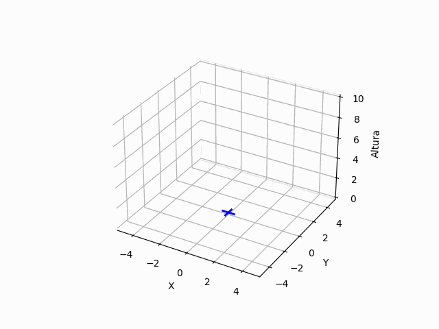

# N-FCU: Autonomous Takeoff and Landing in Variable Wind Conditions

Welcome to the official GitHub repository for the **Neural Flight Control Unit (N-FCU)**, a project that enables autonomous takeoff and landing of drones in challenging variable-wind environments. This work forms part of a doctoral thesis at the **Public University of Navarre (UPNA)**, aiming to enhance UAV robustness and reliability.

## Project Overview

The N-FCU employs advanced **Reinforcement Learning (RL)** techniques to train a neural network controller capable of handling complex aerodynamic disturbances caused by wind. Unlike traditional PID controllers, which often struggle in dynamic and unpredictable conditions, the N-FCU adapts its control policy to maintain stability and precision during critical flight phases.

This repository contains the code, trained models, and experimental data generated throughout the project, promoting **open science** and **reproducibility**.

## PID Takeoff Performance in Variable Wind (1 m/s – 8 m/s)

The GIFs below highlight the limitations of a tuned PID controller during takeoff as wind speed increases.

<table>
  <tr>
    <td></td>
    <td></td>
    <td></td>
    <td></td>
  </tr>
  <tr>
    <td></td>
    <td></td>
    <td></td>
    <td></td>
  </tr>
</table>

## N-FCU Training Videos

Watch the controller’s learning process and performance under various wind conditions:

🔗 **[N-FCU Training Videos on Google Drive](https://drive.google.com/drive/folders/11DfmCqjhGoYMkDa58pc93ptRO7s79FFs?usp=sharing)**

## Key Features of N-FCU

- **Reinforcement Learning-Based Control**: Utilises PPO and DDPG for adaptive, robust flight control.  
- **Realistic Wind Modelling**: High-fidelity stochastic wind model with gusts and altitude-dependent profiles.  
- **Modular Architecture**: Includes an Adaptation Module that accelerates training and inference.  
- **Optimised Reward Functions**: Custom rewards mitigate issues such as the *Cobra Effect* during takeoff and landing.  
- **Hardware-in-the-Loop (HIL) Validation**: Demonstrated promising sim-to-hardware transfer.  
- **Novel Metric**: Introduces *Relative Wind Capability (CRV)* to quantify UAV robustness against wind.  
- **Open Source**: Full code and resources are available for research and development.  

## Installation and Usage

Step-by-step instructions for setting up the simulation, training the N-FCU, and running experiments will be provided in the `docs/` folder. This will cover installation of **ROS**, **Gazebo**, and all required **Python dependencies**.

## Contributing

Contributions are welcome! Please open issues or pull requests, and consult the forthcoming `CONTRIBUTING.md` for guidelines.

## Citation

If this work supports your research or project, cite:

> Olaz Moratinos, X., Alaez, D., Prieto, M., Villadangos, J., & Astrain, J. J. (2023). Quadcopter neural controller for take-off and landing in windy environments. *Expert Systems with Applications, 225*, 120146.

## License

Licensed under the **MIT License** (to be added).
